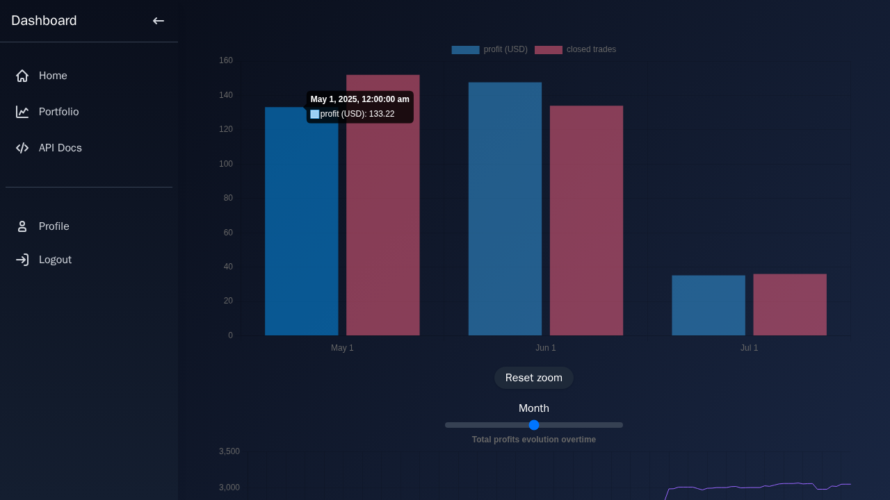

# Finance dashboard

using flask for the backend and svelte for the frontend.

## Preview


## Getting started

### Live version

available at [wsb.eldolfin.top](https://wsb.eldolfin.top/)

### Development

dependencies: just, docker, docker-compose, npm

### Pre-commit Hooks

This project uses pre-commit hooks to ensure code quality. Install them with:

```sh
pre-commit install
```

### Backend

```sh
just dev-docker
```

full deployment with reverse proxy at http://localhost:8085/

api doc at http://localhost:5000/openapi/

## TODO

see the
[V1 issue board](https://gitea.eldolfin.top/Eldolfin/finance-plots/projects/10)
